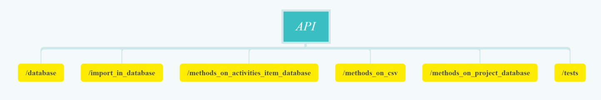
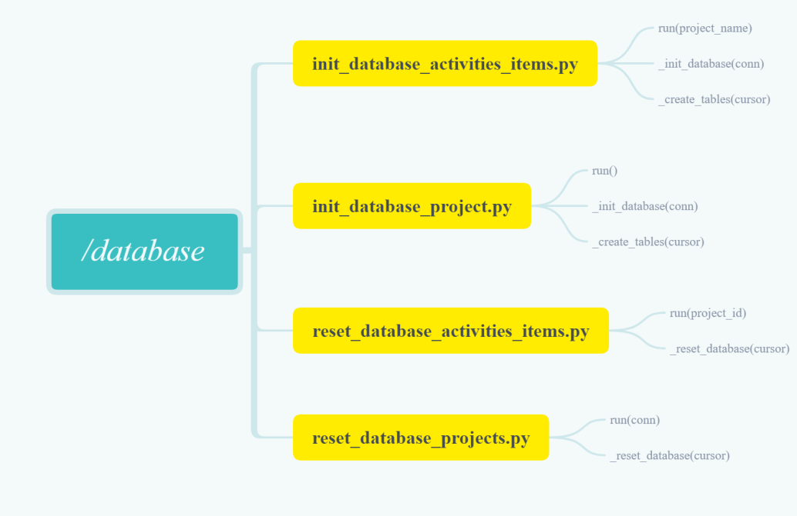
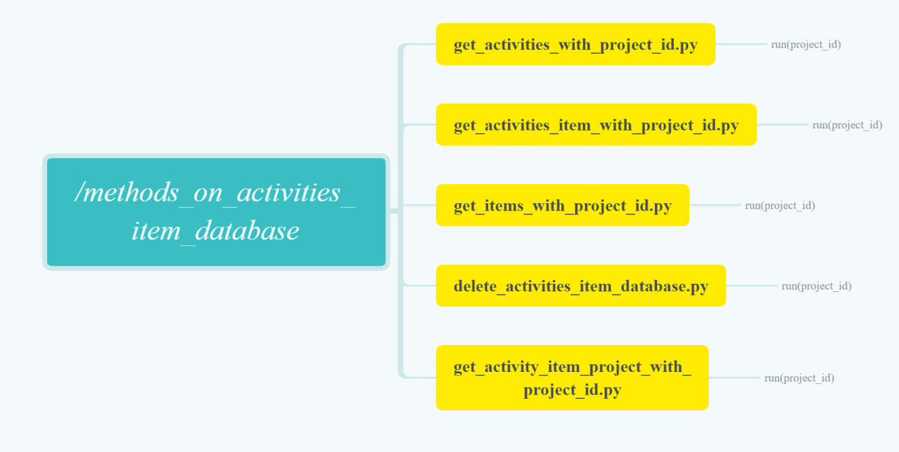
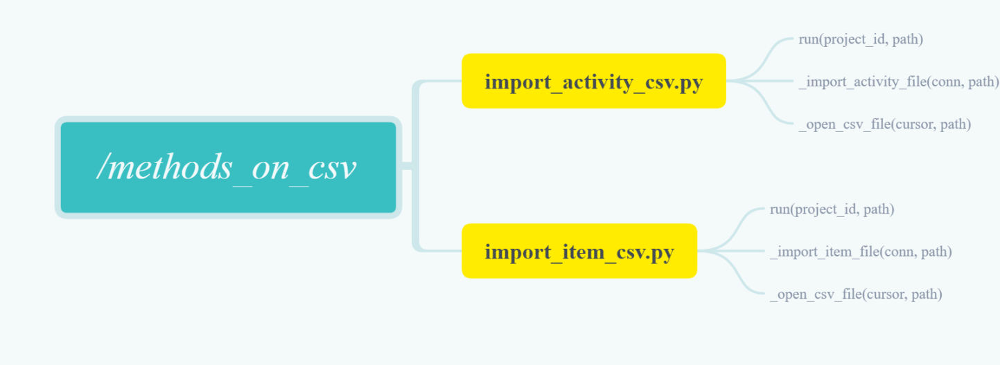
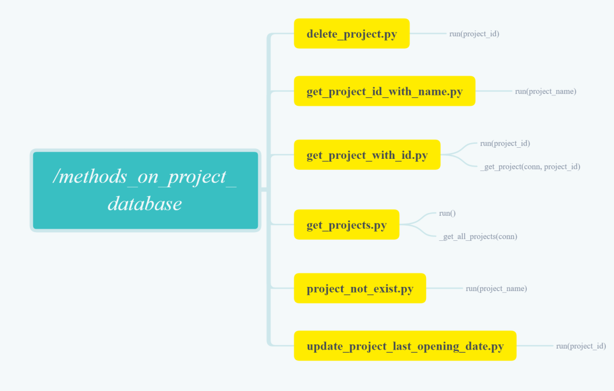
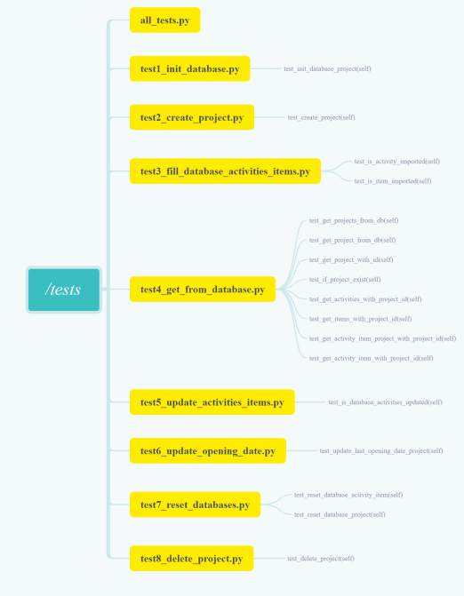

# API's documentation

## Tech used in the API

The API has been done under *Python 3.8.1* with a *SQLite* database 

## Hierarchy of the project

The API was divided into folders containing methods, models, tests, databases files and the coverage files

### List of the folders and what's inside of them

- **csv_test** : contain the CSV files necessary for the tests.
- **database** : contain the methods that create and reset the database.
- **databases_files** : contain the files that contain the database files.
  - *activities_items_db* : contain the database files containing the activities and items.
  - *projects_db* : contain the database file containing the project.
- **htmlcov** : contain the necessary file to launch the coverage.
- **import_in_database** : contain the methods that import in the databases.
- **methods_on_activities_item_database** : contain the methods that delete and get data back from the activities and items database.
- **methods_on_csv** : contain the methods that transform the CSV files.
- **methods_on_project_database** : contain the methods that delete and get data back from the project database.
- **model** : contain the models of the items.
- **tests** : contain the file used to launch the tests.

## Description of  the methods.

- **database** : the methods in database are :
  - *init_database_activities_items* : methods called to create the activities and items databases.
  - *init_databse_project* : methods called to create the projects database.
  - *reset_database_activities_items* : methods called to reset the activities and items databases.
  - *reset_database_project* : methods called to reset the projects database.

  
  
  
- **import_in_database** : the methods in import_in_database are :
  - *activity_item_import* : methods that, with a CSV row, import and item or an activity in the database.
  - *create_project* : methods that create a project  and the activities and items database linked to this project.
  - *update_activity_item* : methods that call reset_database_activities_items and then reimport the new data.

  
  
  
- **methods_on activities_items_database** : methods in methods_on_activities_items_database are :
  - *delete_activities_items_database* : methods that delete the activities items database linked to the project.
  - *get_activities_with_project_id* : methods that get back the activities linked to a project.
  - *get_activities_items_project_with_project_id* : methods that get back the activities, items and project data. 
  - *get_activities_items_with_project_id* : methods that get back the activities, items and project id.
  - *get_items_with_project_id* : methods that get back the items linked to a project.

  
  
  
- **methods_on_csv** : methods in methods_on_csv are : 
  - *import_activity_csv* : methods that import a CSV with a specific format to turn the row into activities to put in database.
  - *import_item_csv* : methods that import a CSV with a specific format to turn the row into items to put in database.

  
  
  
- **methods_on_project_database** : methods on methods_on_project_database are : 
  - *delete_project* : methods that delete a project and delete the activities and items database linked to it.
  - *get_project_id_with_name* :  methods that get the project id thanks to is name.
  - *get_project_with_id* : methods that get back the project in itself (without the activities and items) thanks to the id.
  - *get_projects* : methods that get back a list of projects (without the activities and items).
  - *project_not_exist* : methods that check if a project exist or not thanks to is name.
  - *rename_project* : methods that rename a project thanks to is id.
  - *update_project_last_opening_date* : methods that update the last opening date of a project.

  
 

## Tests
The tests all have a number (test1_******* par exemple) They must be launch in order or they'll bug.
The "all_test" file can launch all test at the same time.

