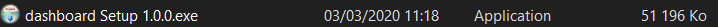

# Dashboard

## Description de l'application

Dashboard permettant la visualisation de données sous la forme de graphique avec différent niveau d'analyse.

## Mise en place du projet
1) Téléchargez/clonez le répertoire GitHub sur votre ordinateur.
2) Executez une des commandes ci-dessous

### Compilation de l'application et de l'api locale avec rechargement à chaud.
```bash
npm run electron:serve
```

### Compilation de l'application et de l'api locale sans "release" sur GitHub
```bash
npm run electron:build
```
#### Windows
Le fichier qui contient l'application s'appelle 'dist_electron'. 
 * Le fichier possède un fichier appellé win--unpacked cotnenant l'application exécutable. 
 
 * Le fichier possède également un installateur basique de l'application.
 

 
### Compilation pour une "release" sur GitHub
```bash
npm run release
```
# Dépendances
### Dépendances Electron
* Electron
* Electron builder
* Electron updater 

### Dépendances JS
* Vue Cli
* VueX
* Vue-router
* Node JS
* ChartJS

### Dépendances PYTHON
* Python
* Pyinstaller
* Coverage
* Numpy
* Pandas


<span style="color: red;">La "release" nécéssite un token d'accès afin de pouvoir publier une "release" sur GitHub, plus d'informations sur <a href="https://github.com/settings/tokens">Générer un token sur GitHub</a></span>.

<span style="color: red;">Si vous êtes contributeur du projet et que vous possédez un token provenant de GitHub , vous devrez créer un fichier nommé "electron-builder.yml" et insérer le code suivant :  </span>

```yml
appId: dashboard
publish:
  provider: github
  token: /* VOTRE TOKEN */
```
### API

[Documentation de l'api](Documentation/FR/Api/Api_FR.md)
